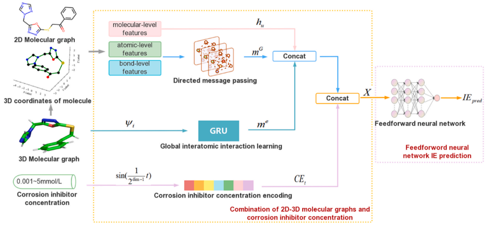

# 2D3DMol-CIC

Official code for "Data-driven corrosion inhibition efficiency prediction model incorporating 2D–3D molecular graphs and inhibitor concentration" (Corrosion Science 2023)

## Dataset

Dataset can be obtained from here:

https://corrosion-inhibitor-dataset.herokuapp.com/

Please put the downloaded files/folders under data/ directory.

## Environment

- PyTorch == 1.9.1
- chemprop == 1.4.1
- hydra == 1.3.2
- tensorboard == 2.8.0
- sympy == 1.11.1 
- scipy == 1.8.0 
- pandas == 1.4.1
- numpy == 1.20.0 
- matplotlib == 3.5.1

## Training
basic-debug: python train.py --config-name=Basic hydra.job.chdir=True

## Evaluation

## Result